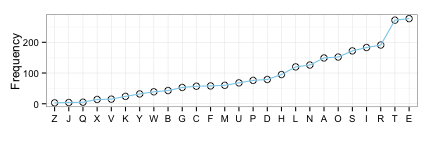

* An example presentation, created in [R Studio][rstudio], with [R Markdown][rmarkdown] and [slidify][slidify]. View the source file [here][source].

---

* The first code block will load libraries, set options for chunks, xtable and so forth.

```r
> library(ggplot2)
> library(xtable)
> library(slidify)
> library(knitr)
> opts_chunk$set(tidy = TRUE, results = "asis", message = FALSE, prompt = TRUE, 
+     dev.args = list(bg = "transparent"))
> options(xtable.comment = FALSE)  # xtable generates ugly comments by default
```

> * Clone this repository for easy authoring of presentations from R Studio, using R Markdown, knitr and slidify. 
> * This slideshow is an example of what the resulting slideshow will look like, and the source index.Rmd file serves as a useful template with (hopefully) good defaults for various settings.
> * Detailed instructions are in the readme file of this repository.

---

## Write a script in R Markdown
* Because this script is about itself, so is the data. I would like to know about the frequency of different letters in this script. 


```r
> con = file("index.Rmd", open = "r")
> letters = toupper(unlist(strsplit(readLines(con), "")))
> close(con)
> letters = as.data.frame(table(gsub("[[:punct:], [:blank:], [:digit:]]", replacement = "", 
+     letters)))[-1, ]
> print(xtable(head(letters)), type = "html", include.rownames = F, width = 4)
```

<table border=1>
<tr> <th> Var1 </th> <th> Freq </th>  </tr>
  <tr> <td> A </td> <td align="right"> 139 </td> </tr>
  <tr> <td> B </td> <td align="right">  38 </td> </tr>
  <tr> <td> C </td> <td align="right">  53 </td> </tr>
  <tr> <td> D </td> <td align="right">  78 </td> </tr>
  <tr> <td> E </td> <td align="right"> 246 </td> </tr>
  <tr> <td> F </td> <td align="right">  55 </td> </tr>
   </table>

---

## 4. Write a script in R Markdown
* After having obtained the counts, I want to sort and plot them.

```r
> # Ordering data frames is unnecessarily complicated in R.
> letters = letters[order(letters$Freq), ]
> letters$Var1 = factor(letters$Var1, as.character(letters$Var1))
> ggplot(letters, aes(Var1, Freq)) + geom_point(shape = 21, size = 3) + geom_line(aes(group = 1), 
+     color = "skyblue") + labs(x = "", y = "Frequency") + theme_bw() + theme(plot.background = element_rect(fill = "transparent", 
+     color = "transparent"))
```



---

## 5. "Compile" the presentation
* The next step is to create the presentation out of the R Markdown file. Slidify integrates well with Github, and creates a new branch in your github repository. This branch is actually that repository's website.

```r
> slidify("index.Rmd")
> publish_github("presentation-template", "mvuorre")
```

* You can now access the presentation at [http://mvuorre.github.io/presentation-template/](http://mvuorre.github.io/presentation-template/)


[rstudio]: http://www.rstudio.com/
[rmarkdown]: http://rmarkdown.rstudio.com/
[slidify]: http://slidify.github.io/
[source]: http://mvuorre.github.io/presentation-template/presentation/index.Rmd
